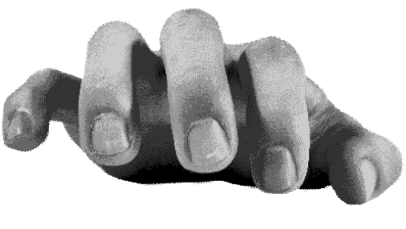

小时候父亲跟我说话的印象都是很戏谑,不耐烦.于是我很害怕父亲.随后长大了之后也学会了这么说话,但我发现这貌似并不是我感受到的戏谑,他并没有那种情绪,正常说话就是如此.但我已经改不掉说话的习惯.

孩子从家长身上学到了家长不存在的东西么,或许孩子是学习以自己心理投射出的父母,家长在无意识间将自身的创伤"加密"传递给了孩子,孩子通过模仿童年时的"父母"来试图证明自己摆脱了童年的创伤,然而这只是一次次复制痛苦.不过有点太绝对了

或许吧.人们在理解别人时实际上了解的并不是真实的"客体",而是一个由自己主观层面上感受到的内在意识投射,可能或许就是所谓的"内在父母形象"吧.这个形象不是真实父母的完整复制,而是混合了孩子的恐惧,期待,误解与幻想....那个幻想中的"父亲",可能会比现实中的父亲更加锋利,漠然.

不过也不能太过,这是孩子们在认知有限与极度敏感情况下能做到的最有效的预测模型?或许父母亦是,父母年幼时从他们的父母形成的预测模型来当父母.

这么解释很锋利,也有些无奈,很多时候人了解一个人并不是真的了解一个人,而是主观体验到的人,我们永远只能接触到现象,也就是被认知结构过滤后的世界...

说到这,Jean-Paul Sartre 写过的"他人即地狱"指的并不是他人可怕,而是他人的目光会把你固定成一个形象,同样,你也在用一个框架固定成一个形象.

家庭中即使如此,家长在无意识间将自身的创伤"加密"传递给了孩子,孩子通过模仿童年时的"父母"来试图证明自己摆脱了童年的创伤,然而这只是一次次复制痛苦....吗?我想了想这段话,或许传递的并不是创伤,而是应对创伤的机制,某种意义上这种机制会创造新的创伤.或许在某段时间内,这个方法的确有效果,但时过境迁终究会失效,或者说注定会失效,但这个模型依旧在运行.

越想越奇怪啊,我们既可以被塑造,也可以在成长过程中自行重塑.创伤可以跨代重塑,觉察亦可跨代终止...

Nope,我不对我的这些观点负责,纯主观论断,请勿在意.想了想最后聊聊自己为什么学会那样保护自己的方式?大概还是父母离婚的那段压抑时光.不过就提一嘴,毕竟最后也是给自己去看,反思,提出新的观点.

我想我对父母的憎恨已不再像那段时光,他们充其量也只是和我一样的人.或许这就叫做释怀吧,

